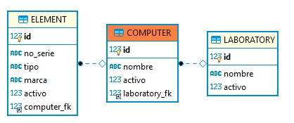
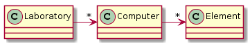

## Escuela Colombiana de Ingeniería

### CVDS – Ciclos de vida del Desarrollo de Software
### Parcial Segundo Tercio


**IMPORTANTE**

* Se puede consultar en la Web: APIs/Documentación de lenguaje y frameworks (Primefaces, Guice, MyBatis, etc), y enunciados de los laboratorios (se pueden revisar los fuentes incluidos con los dichos enunciados).
* No se permite: Usar memorias USB, acceder a redes sociales, clientes de correo, o sistemas de almacenamiento en la nube (Google Drive, DropBox, etc). El uso de éstos implicará anulación.
* El filtrado y ordenamiento de los datos DEBE realizarse en el motor de base de datos, a través del uso de SQL. Consultar todos los datos y filtrarlos en el servidor de aplicaciones -que es supremamente INEFICIENTE- se evaluará como INCORRECTO.


Se le han dado los fuentes de un avance parcial de una plataforma de gestión de equipos del laboratorio. En esta plataforma los usuarios podrán crear, consultar y asociar elementos, equipos y laboratorios.

Para el Sprint en curso, se han seleccionado las siguientes historias de usuario del Backlog de producto:

Recuerde que en el formato XML no se puede utilizar '<' y '>', por ejemplo al realizar comparaciones, utilice '&amp;lt;' o '&amp;gt;' respectivamente. 

## Historia de usuario #1

  > **Como** Usuario de la plataforma de equipos
  >
  > **Quiero** Poder consultar los elementos de un equipo.
  >
  > **Para** Poder validar los equipos que no se encuentran completos y ver los elementos asociados a cada uno.
  >
  > **Criterio de aceptación:** Se deben mostrar todos los elementos asociados a uno de los equipos, y la consulta debe contener el serial, marca, tipo, activo y nombre del equipo.


## Historia de usuario #2

  > **Como** Administrador de la plataforma
  >
  > **Quiero** Tener un reporte de los equipos que actualente no se encuentran completos.
  >
  > **Para** Realizar los ajustes necesarios para mantener todos los equipos en optimas condiciones.
  >
  > **Criterio de aceptación:** El reporte NO debe requerir entrar parámetro alguno. Se considerá como equipo incompleto aquel que no contenga 4 elementos(todos activos). Se debe mostar el listado de nombres de los equipos.

# Modelo 

El modelo de base de datos y de clases asociados a la implementación parcial son los siguientes:





A partir de la aplicación base suministrada, debe realizar lo siguiente:

Dado el id de un equipo obtener todos los elementos asociados a este.

Mostrar los nombres de los equipos que no se encuentran completos.


1.  (50%) Implemente la historia de usuario #1, agregando todo lo que haga falta en la capa de presentación, lógica y de persistencia. La vista debe implementarse en `elements.xhtml`.

2.  (50%) Implemente la historia de usuario #2, agregando todo lo que haga falta en la capa de presentación, lógica y de persistencia. La vista debe implementarse en `incompletecomputer.xhtml`.


## Entrega

Siga al pie de la letra estas indicaciones para la entrega del examen. EL HACER CASO OMISO DE ESTAS INSTRUCCIONES PENALIZARÁ LA NOTA.

1. Limpie el proyecto

	```bash
	$ mvn clean
	```

1. Configure su usuario de GIT

	```bash
	$ git config --global user.name "Juan Perez"
	$ git config --global user.email juan.perez@escuelaing.edu.co
	```

2. Desde el directorio raíz (donde está este archivo README.md), haga commit de lo realizado.

	```bash
	$ git add .
	$ git commit -m "entrega parcial - Juan Perez"
	```


3. Comprima todo el proyecto. Se puede realizar desde el la interfaz del explorador de archivos o con el comando: (no olvide el punto al final)

	```bash
	$ zip -r APELLIDO.NOMBRE.zip .
	```

4. Abra el archivo ZIP creado, y rectifique que contenga lo desarrollado.

5. Suba el archivo antes creado (APELLIDO.NOMBRE.zip) en el espacio de moodle correspondiente.

6. IMPORTANTE!. Conserve una copia de la carpeta y del archivo .ZIP.
